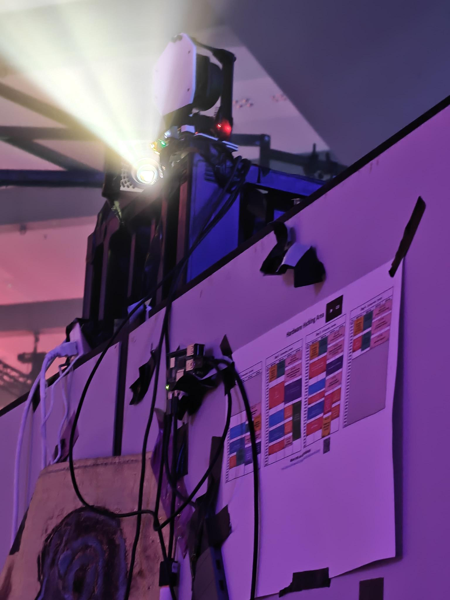
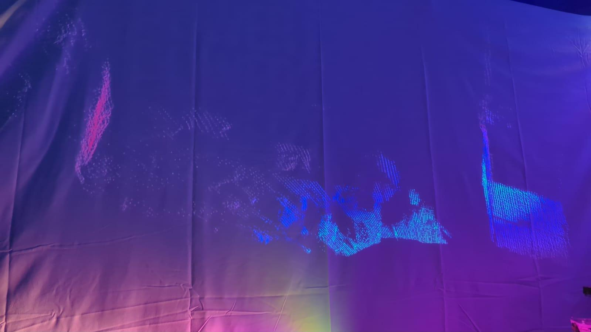

# LIDAR based 3D Room Scanner





## Prequesites
Besides the specific components used to build this project, the following Hardware and Software is required:

1. 3D Printer: I used the Anycubic Kobra 3
2. Soldering Iron
3. Basic Tooling (screw drivers, ruler, level, etc)
4. Linux (I didn't bother trying to build this for windows) with the following software:
    * [OpenSCAD](https://openscad.org/)
    * [ESP-IDF](https://docs.espressif.com/projects/esp-idf/en/stable/esp32/get-started/linux-macos-setup.html)
    * C++ Tooling (Clang, Make, etc.)
5. Consumables (Filament, lubrication oil)

### Components
The following components where used for the project. Added (non affiliate) links to Amazon, and prices, but the same components can be bough cheaper on other platforms as well:
1. [SlamTec RPLidar A1](https://www.amazon.de/dp/B07VLFGT27) (70€)
2. [ESP32 Development Board](https://www.amazon.de/dp/B0DGG7LXMF) (8€)
3. [M996R Servo](https://www.amazon.de/dp/B07H87592P) (32€): Technically only one is required, but quality varies a lot, so you may need to test out a few to find one that works well enough
4. [8 times M2x6, 4 times M2.5x8, 12 times M3x8 screws](https://www.amazon.de/dp/B0DBTNWDJB) (5€)
5. [2 times M5x16 6x M5x12 screws](https://www.amazon.de/dp/B0D258MS9F) (15€)
6. 8 times M3 nuts (included above)
7. [4 times M2x4 and 4 M2x3, 6 times M5x6, 2 times M5x10 and 1 quarter inch thread insert](https://www.amazon.de/dp/B0D1VKC5K9) (15€)
8. [Ball bearing turning table](https://www.amazon.de/dp/B0B3X7R961) (8€)
9. [Camera Tripod](https://www.amazon.de/dp/B0B8YHTWGY) (33€)

The total cost for me therefore was around 185€ as an initial cost. But with most of the screws and threads being more than you need for one project, and ESP32 and M996 being quite expensive on Amazon, the whole project can probably be done with a budget of around 120€.

## Building
To build the Project first the hardware needs to be printed and assembled.

### 3D Printing

The [platform.scad](CAD/platform.scad) contains the CAD files for all the 3D printable parts, but as a single file and arranged in position of assembly.
The file contains 6 different objects:
1. Tripod Mount
2. Bottom platform
3. Top Platform
4. Lidar Mount
5. 2 Beams for fixating the Lidar mount further

To print these parts, you need to isolate each part (by setting all other part visibilities to false in the beginning of the scad file), rendering that part and exporting it to STL.

All parts are designed that, when oriented correctly, they can be printed without supports.

My colorized print takes around 6 hours for a full print of all parts, on two different plates, and consumes roughly 110g of PLA filament.

### Assembling the Print

After printing, the thread inserts need to be melted into the 3D prints using a soldering iron.

#### Tripod Mount
On the bottom you need to melt in the quarter inch thread insert, and on the top 4 M3x4 threads on which the bottom platform will be screwd onto.

#### Bottom Platform
The bottom platform has in the middle the mount point for the servo. Here you need to insert 4 M2x4 threads.

Afterwards you can screw the platform onto the tripod mount using 4 M3x6 screws.
Once the Tripod Mount is attached to the bottom platform, screw it onto the turning table using 4 M3x6 screws and fixate using nuts.

Add 4 M3x6 screws to the top of the turning table, and fixate with nuts. The nuts will serve as padding between the turning table and the top platform, which wil be put on to p of the M3 screws.

#### Lidar Mount
Add the 2 M5x10 thread inserts at the bottom. Afterwards screw the M2.5x8 screws in the holes on the back. Note the holes are designed that the head of the screw can be inserted deep into the print.

Fixate the RPLidar A1 using the M2.5 screws.

#### Beams
Add the 6 M5x6 inserts into the ends of the beams. Screw the smaller beam to the top of the larger one using M5x12 screws.
The feet point inwards on both beams.

#### Top Patform
The top platform has 4 inlets for mounting the servo onto. Add 4 M2x3 thread inserts in the yellow tubes.

Afterwards screw the Lidard mount very tightly using 2 M5x16 screws onto the top platform, as well as the long beam using 2 M5x12 screws and the end of the short beam to the top of the Lidar mount using the last 2 M5x2 screws.

Note the top beam adds an obstacle for the scan. As it is on top where usually only the roof of the room is, this is usually not an issue. But if you want a clear scan of the top of the lidar, you can also remove the beam but this may result in some shakier measurements when the lidar is running.

After assembling the platform and lidar mount, put it on top of the turning table, using the already prepared screws and fixate using nuts.

Do not yet add the servo, as it needs to be set to the 0 position first.

#### Tripod
Once you assembled all the parts as described above, you can simply mount it on the tripod using the quarter inch screw insert on the bottom.

## Software
The software for this project consists of three programs:
1. The control software for the servo running on the esp
2. The software performing the scan and collecting the pointcloud
3. A visualization software for viewing, filtering and exporting the pointcloud

### Servo Control
The first program located in the `servocontrol` directory uses an ESP to read control commands via serial and uses them to adjust the servo to certain degrees. The software was written for an ESP32 as this was the development board available for the project. But as servo is controlled via a single PWM pin and none of the more advanced features of the ESP are used, smaller and cheaper boards like the ESP c3 mini or something even smaller like an AVR could also be used.
Also a consideration may be to combine the servo controlling functionality with the scanning on a raspberry pi or similar devices that support hardware PWM.

The code is written using the plain ESP-IDF without any advanced libraries like arduino, which provides high speed 16 bit resolution PWM channels. Porting to smaller ESP boards may therefore require to adjust some of these settings. Most importantly, with changing the bitsize of the PWM channel the absolute values for relative percentages change.

To use this software simply build with the ESP-IDF and flash to your ESP board:
```bash
$ idf.py build
$ idf.py -p /dev/ttyUSB0 flash
```

#### Calibration
Once you power the ESP and connect the servo (pin 18 in this configuration) the servo should be turning rougly to the origin. The exact orientation at which PWM value is highly dependent on the product and therefore requires calibration. Additionally the servo insert only fits the insert at certain angles, meaning after the servo has been resetted to the origin position, it can be assmbled and calibrated.

For the final part of the assembly mount the servo onto the bottom platoform such when mounting on the top platform the black arrow of the top platform is roughly at or slightly below the the rightmost edge of the scale of the bottom platform. It does not need to align perfectly. Screw the servo on and connect it back to the ESP.

To start the calibration connect the ESP to the computer and open up a COM terminal to the ESP command line interface:
```bash
$ idf.py -p /dev/ttyUSB0 monitor
# Or if no esp-idf available
$ screen /dev/ttyUSB0 115200
[...]
|>
```
In this interface you can start the calibration with
```bash
|> calibrate start 1000 3000
```
This will start the calibration process for the 0° PWM value with between 1000 and 3000. The calibration consists of a binary search where at each step you need to check the needed if it's above or below the 0° point on the measurement scale of the bottom platform and then react with `+` or `-` to go higher or lower respectively.

After you did the 0° calibration, do the same for the 180° calibration:
```bash
|> calibrate stop 7000 9000
```
Note if you are using a different ESP with a different resolution, e.g. the c3 mini with only 14 bit resolution, you must adjust these values accordingly (value/2^16*2^14). Also before running adjust `DEFAULT_START` and `DEFAULT_STOP` in the C code accordingly, otherwise the servo might be fried.

After calibration you can test a few different angles using the set command:
```bash
|> set 0
|> set 10
|> set 45
|> set 90
|> set 112.5
|> set 180
```
And see if it moves as expected.

The calibrated values are not stored permanently in the ESP, if you want to make these calibrations permanent, simply change the defines `DEFAULT_START` and `DEFAULT_STOP` with the new values and compile and re-flash.

Once calbibration is finished you are good to go and start scanning.

### Scanning Application
The scanning application is a Linux only application written in C++ located in `scanapp`. It relies on the RP-Lidar SDK to communicate with the lidar. The RP-Lidar SDK is included as a submodule in this repository, so make sure you checked out all the submodules before running the make script.

The build script requires clang as c++ compiler, even though the code should be fully ISO C++ 20 compliant and therefore also be compilable with g++ if the buildscript is adjusted. To build just run `make` and the executable should be compiled into `bin/scanapp`.

To start scanning you need to provide the COM ports to the lidar and the ESP as command line arguments. Additionally further arguments can be specified to either narrow the scan range or specify output formats. For further details see the help page. To give an example:
```bash
bin/scanapp -b scan.dat -l 315 -l 45 -f 60 -t 120 -s 0.5 /dev/ttyUSB0 /dev/ttyUSB1
```
This scans a narrow area in front of the scanner 60°-120° horizontally and vertically the slice between 315° and 40° (going over 0/360, as 0° is directly in front of the scanner and 90° and 270° being straight up and down). It has a step width of half a degree. This should give quite a high resolution scan of something, e.g. a person in front of the scanner.

It should be noted that the effectively reachable resolution depends on the servo. Not all can reach 0.5° horizontal resolution. In those cases it will become a sort of "ghost" resolution, where the application believes the servo has moved but the points received are the same as before just copying the same points at an offset. The best way to figure out whats the smalles resolution the servo can achieve is to set different angles and feel or hear if the servo starts moving:
```bash
# idf.py -p /dev/ttyUSB0 monitor
|> set 10
|> set 11
|> set 11.5
|> set 30
|> set 30.5
|> set 30.75
...
```
Note it's to be expected that with small resolutions the servo may from time to time skip a step, as long as most of the time it's still moving it should be fine.

That said, the ghost resolution can also be useful from time to time as a form of interpolation.

#### Live Rendering

The software also allow live rendering and updating while scanning. This can be done with the `--preview`/`-p` flag. Additionally the `--continuous`/`-c` can be used to instead of doing a single scan to continuously update the resulting image with new data.
The visualization is still not that fleshed out, e.g. all the parameters for the viewing angles, movement, zoomm, etc. are currently hardcoded in the code.